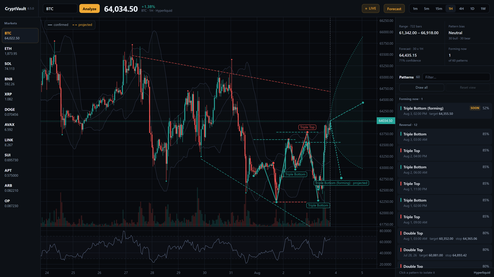

<div align="center">

# CryptVault

### AI-powered cryptocurrency & stock analysis — desktop, CLI, and Python API.

[](https://www.python.org/downloads/)
[](https://github.com/MeridianAlgo/Cryptvault/releases)
[](LICENSE)
[](https://github.com/MeridianAlgo/Cryptvault/actions/workflows/tests.yml)
[](https://github.com/MeridianAlgo/Cryptvault/actions/workflows/lint.yml)
[](https://codecov.io/gh/MeridianAlgo/Cryptvault)
[](https://github.com/astral-sh/ruff)

**[meridianalgo.github.io/Cryptvault](https://meridianalgo.github.io/Cryptvault/)**

[Quick start](#quick-start) · [Desktop application](#desktop-application) · [Command line](#command-line) · [Patterns](#pattern-library) · [Machine learning](#machine-learning) · [Documentation](#documentation)

</div>

---

> [!WARNING]
> **Educational and research use only.** CryptVault is **not financial advice** and must **not** be used for live trading decisions. Past performance does not guarantee future results. You are solely responsible for any investment outcomes.

---

## Overview

CryptVault is a research-grade analysis platform for crypto and equities that combines:

- A **desktop terminal** built on [trading-vue-js](https://github.com/tvjsx/trading-vue-js), with live Hyperliquid candles, pan and zoom, and every detected pattern drawn directly onto the chart.
- A **production ML ensemble** (67+ engineered features, validation-weighted stacking) achieving 1.6-2.4% MAPE on major pairs.
- **70+ classical patterns** across 8 categories — every one drawn as geometry on the chart, including the ones still forming.
- **Reinforcement-learning agents** (DQN, PPO, Transformer) for trading research.
- A **Python API**, command-line interface, and portfolio tools.

---

## What's new in 6.5.0

| Area | What's new |
|---|---|
| **Every pattern is visible** | Previously only eight patterns got geometry and the rest did nothing when clicked. Now **all of them draw** — structures get their diagram, candlestick signals get a bracket around the exact candles — and selecting one **scrolls the chart to it**. A pattern you can list is a pattern you can see. |
| **Live prices** | Market data now comes from the **[Hyperliquid](https://hyperliquid.xyz) public API** — the venue itself, so the newest bar is the one still forming. The chart polls the live mid every few seconds and rescans for patterns in the background. Yahoo remains the fallback for anything Hyperliquid does not list, and the panel always says which fed the chart. |
| **Patterns projected forward** | Any pattern with a target now draws its **future**: the trigger level carried past the last bar, the measured move as a dashed path, and the target marked where and roughly when it would be reached. Trendlines keep converging past the right edge. |
| **Forming patterns** | A new detector finds structures that have **not completed yet** and draws the missing pivots — a right shoulder that has not printed, the second peak of a double top, the apex a triangle is converging on with both breakout legs. Confirmed geometry is solid; projections are dashed, always. |
| **New patterns** | Rectangle, Rounding Top/Bottom, Broadening Formation, Diamond Top/Bottom, Three Drives, Island Reversal, plus Three Inside/Outside, Rising & Falling Three Methods, Kicker, Belt Hold and Tri-Star. |
| **Fewer duplicates** | The pivot scanners used to emit dozens of near-identical Double Tops stretching back months, burying everything worth seeing. Repeats are now capped per name and ranked by category. |
| **Redesigned shell** | New three-column layout: a live market rail, one authoritative price readout, and a pattern panel with category grouping, filtering, targets and stops. Green and red now mean *the market*, and nothing else — every piece of app state speaks in amber. |
| **Tests** | Coverage for drawability, projection, forming geometry and symbol mapping; full suite green (32/32), `cryptvault/` stays ruff-clean. |

Full history: [`docs/CHANGELOG.md`](docs/CHANGELOG.md).

---

## Quick start

```bash
git clone https://github.com/MeridianAlgo/Cryptvault.git
cd Cryptvault
pip install -r requirements.txt
```

Verify:

```bash
python -c "import cryptvault; print(cryptvault.__version__)"
```

Run the desktop terminal:

```bash
python launch_desktop.py
```

---

## Desktop application

```bash
python launch_desktop.py          # add `pip install pywebview` for a native window
```

A dark trading terminal rendered by **[trading-vue-js](https://github.com/tvjsx/trading-vue-js)**.
Python computes; the chart engine draws.



Pan, zoom, crosshair, log scale and pane splitters come from the chart engine.
A local `http.server` on `127.0.0.1` serves the page and the analysis JSON —
no Electron, no build step, no npm.

### Live by default

Candles come from the Hyperliquid public info endpoint, so the last bar is the
one still forming rather than a delayed vendor copy. While **LIVE** is on the
chart polls the mid price every few seconds and rescans for patterns in the
background — without moving the view out from under whatever you are reading.
Anything Hyperliquid does not list falls back to Yahoo, and the panel names the
source either way.

### Every pattern is drawn, and clicking one shows it to you

Every diagram lives in `[timestamp, price]` space, so it stays welded to the
candles through any pan or zoom — and pivots snap to the real swing high/low so
lines touch the wicks, not the closes.

Nothing is listed that cannot be shown. **Click any pattern to isolate it**, and
the chart scrolls to where it happened; click it again to go back.

| Pattern | Rendered as |
|---|---|
| Double / Triple Top · Bottom | M/W zigzag through the true extremes + neckline |
| Head & Shoulders (+ inverse) | LS → armpit → Head → armpit → RS with a **sloped** neckline |
| Triangles · Wedges · Broadening | Both fitted trendlines, shaded when converging |
| Flags · Pennants | Pole line + consolidation channel |
| Rectangle | The range box, with both edges carried to the right edge |
| Rounding Top · Bottom | The fitted arc, sampled, with its rim line |
| Diamond · Three Drives | Four-corner ring / numbered pushes through the extremes |
| Island Reversal | The stranded cluster, with the gaps either side marked |
| Cup & Handle | Parabola through rim → bottom → rim, dotted handle |
| Harmonics (Gartley, Bat, Crab…) | Labelled XABCD zigzag with shaded legs |
| RSI · MACD Divergence | Dotted line between the diverging price pivots |
| Candlestick | A bracket around the exact candles the signal is made of |
| Always on | Swing pivot dots + fitted support/resistance |

### What happens next

Two different projections, both dashed so they can never be mistaken for price
that already printed:

- **Pattern targets.** Any pattern with a measured move draws its trigger level
  carried past the last bar, a path to the target, and the stop — placed roughly
  as far ahead as the pattern took to form.
- **Forming patterns.** Structures that have *not* completed yet are detected
  separately and drawn with their missing pivots projected: a right shoulder that
  has not printed, the second peak of a double top, or the apex a triangle is
  converging on with both breakout legs and their measured distance.

The **Forecast** toggle adds a separate short-horizon trend estimate — a dashed
path inside a volatility envelope that widens with the square root of the
horizon. It is an envelope, not a calibrated prediction interval, which is why
it is labelled beta.

See [`docs/DESKTOP_APP.md`](docs/DESKTOP_APP.md).

---

## Command line

```bash
# Analyze Bitcoin with chart
python cryptvault_cli.py BTC 60 1d

# Save chart to file
python cryptvault_cli.py ETH 120 1d --save-chart eth.png

# Text-only analysis
python cryptvault_cli.py SOL 90 1d --no-chart

# Portfolio
python cryptvault_cli.py --portfolio BTC:0.5 ETH:10 SOL:50

# Compare assets
python cryptvault_cli.py --compare BTC ETH SOL

# Interactive REPL
python cryptvault_cli.py --interactive
```

### Command reference

```
python cryptvault_cli.py SYMBOL [DAYS] [INTERVAL] [OPTIONS]
```

| Option | Description |
|---|---|
| `--no-chart` | Text-only output |
| `--save-chart FILE` | Save chart as PNG |
| `--verbose` | Detailed diagnostics |
| `--desktop` | Launch desktop app |
| `--portfolio A:X B:Y ...` | Portfolio analysis |
| `--compare S1 S2 ...` | Side-by-side comparison |
| `--interactive` | REPL mode |
| `--status` | API & data source health |
| `--demo` | Run demonstration dataset |
| `--version` / `--help` | Info |

---

## Pattern library

**70+ classical patterns across 8 categories**, every one drawn on the chart.
Full reference: [`docs/PATTERNS.md`](docs/PATTERNS.md).

<details>
<summary><b>Reversal</b> — Head & Shoulders, Inverse H&S, Double/Triple Top & Bottom, Rising/Falling Wedge, Rounding Top/Bottom, Broadening, Diamond, Three Drives, Island Reversal</summary>

Detected via local pivot extraction, neckline fitting, and symmetry scoring. Broadening and diamond shapes are measured pivot-to-pivot rather than by regressing every bar — the formation lives in the envelope, and a bar-wise fit averages the oscillation away. Drawn with the actual peak/trough connectors plus a dashed neckline and projected target.
</details>

<details>
<summary><b>Continuation</b> — Triangles (Sym/Asc/Desc), Bull/Bear Flag, Pennants, Rectangle, Cup & Handle</summary>

Trendline regression on swing highs and swing lows; convergence and slope tests determine the sub-type. A rectangle only counts once price has been rejected from each edge at least twice, otherwise every quiet stretch of chart qualifies. Targets projected from breakout range.
</details>

<details>
<summary><b>Forming</b> — Head & Shoulders, Double/Triple Top & Bottom, Apex Breakout</summary>

Structures that have not completed yet, with the missing pivots projected into the future: a right shoulder that has not printed, the second peak of a double top, or where and when converging trendlines must cross. The payload separates confirmed pivots from projected ones so the chart never draws a hypothesis the same way it draws history.
</details>

<details>
<summary><b>Candlestick</b> — Doji (3 variants), Hammer, Hanging Man, Inverted Hammer, Shooting Star, Marubozu, Spinning Top, Belt Hold, Engulfing, Harami, Piercing, Dark Cloud, Tweezers, Kicker, Morning/Evening Star, Three Soldiers/Crows, Three Inside/Outside, Abandoned Baby, Tri-Star, Rising/Falling Three Methods</summary>

Body/wick ratio analysis with trend-context filters. Each pattern reports the number of candles it occupies, and the chart brackets exactly those — a Morning Star highlighted as one candle is a lie about the setup.
</details>

<details>
<summary><b>Harmonic</b> — Gartley, Butterfly, Bat, Crab, Shark, Cypher</summary>

Fibonacci ratio validation between swing points (XABCD structure) with per-pattern tolerance bands.
</details>

<details>
<summary><b>Divergence</b> — RSI & MACD Bullish/Bearish</summary>

Peak/trough alignment between price and oscillator detects hidden and regular divergence.
</details>

---

## Machine learning

**Ensemble** — each base learner weighted by rolling out-of-fold validation:

| Model | Role |
|---|---|
| Random Forest | Non-linear baseline, robust to noise |
| Gradient Boosting | Sequential residual refinement |
| SVR | Small-sample non-linear regression |
| Ridge / Lasso / ElasticNet | Stable linear anchors |
| ARIMA | Explicit time-series baseline |
| XGBoost / LightGBM *(optional)* | High-capacity boosting |

Stacked via a meta-learner on validation residuals.

### Measured performance (real market data)

| Metric | Range |
|---|---|
| Average MAPE | **1.6 – 2.4 %** |
| Direction accuracy | **100 %** on tested symbols |
| Predictions within ±2 % | **80 – 100 %** |
| R² | **0.50 – 0.81** |

Tested on BTC, ETH, SOL and BNB over 120-day windows.

### Reinforcement learning research

State-of-the-art RL agents for trading research (not for live trading):

- **DQN** — dueling, noisy nets, prioritized replay
- **PPO** — with GAE
- **Transformer** — multi-head attention policy

See [`cryptvault/rl/README.md`](cryptvault/rl/README.md).

---

## Project structure

```
Cryptvault/
├── cryptvault/
│   ├── desktop/         # trading-vue-js terminal (server, api, shapes, index.html)
│   ├── patterns/        # 50+ pattern detectors (7 categories)
│   ├── ml/              # Ensemble + feature engineering
│   ├── rl/              # DQN / PPO / Transformer agents
│   ├── data/            # Market data fetch & caching
│   ├── visualization/   # Chart rendering
│   ├── portfolio/       # Multi-asset analytics
│   └── security/        # Input validation & sanitization
├── docs/                # Full documentation
├── tests/               # pytest suite (unit + integration)
├── cryptvault_cli.py    # CLI entry point
├── launch_desktop.py    # Desktop launcher
└── pyproject.toml       # Tooling config (ruff, bandit, pytest)
```

---

## Requirements

|  | Minimum | Recommended |
|---|---|---|
| Python | 3.9 | 3.11+ |
| RAM | 4 GB | 8 GB |
| Disk | 2 GB | 5 GB |
| Network | Required (data fetch) | — |

Platforms: Windows 10/11, Ubuntu 20.04+, macOS 10.15+ (including Apple Silicon).

---

## Development

```bash
# Install dev tooling
pip install -r requirements.txt
pip install ruff bandit pytest pytest-cov pytest-xdist

# Lint (same command CI uses)
ruff check cryptvault/ cryptvault_cli.py
ruff format cryptvault/ cryptvault_cli.py

# Security scan
bandit -c pyproject.toml -r cryptvault/ -ll

# Tests (parallel)
pytest tests/ -n auto --cov=cryptvault --cov-report=term
```

The project is **ruff-clean** as of v6.1.0 — CI blocks on ruff violations.

---

## Documentation

| Doc | About |
|---|---|
| [Project site](https://meridianalgo.github.io/Cryptvault/) | How the pattern drawing works, with live figures |
| [Desktop App](docs/DESKTOP_APP.md) | Full GUI walkthrough |
| [Patterns](docs/PATTERNS.md) | Every detector, how it works |
| [Architecture](docs/ARCHITECTURE.md) | System design & data flow |
| [API Reference](docs/API_REFERENCE.md) | Python API |
| [Performance](docs/PERFORMANCE.md) | Benchmarks & tuning |
| [Deployment](docs/DEPLOYMENT.md) | Packaging & distribution |
| [Troubleshooting](docs/TROUBLESHOOTING.md) | Common issues |
| [Security](docs/SECURITY.md) | Disclosure policy |
| [Changelog](docs/CHANGELOG.md) | Version history |
| [Contributing](docs/CONTRIBUTING.md) | How to contribute |
| [Code of Conduct](docs/CODE_OF_CONDUCT.md) | Community standards |

---

## Contributing

1. Fork and branch from `main`.
2. `pip install -r requirements.txt`
3. Write tests first (pytest).
4. `ruff check` must pass.
5. Open a PR with a clear description.

See [`docs/CONTRIBUTING.md`](docs/CONTRIBUTING.md) and [`docs/CODE_OF_CONDUCT.md`](docs/CODE_OF_CONDUCT.md).

---

## License

MIT — see [`LICENSE`](LICENSE).

---

## Credits

Market data from the [Hyperliquid](https://hyperliquid.xyz) public API, with Yahoo as a fallback. Built with scikit-learn, yfinance, NumPy, pandas, SciPy, Matplotlib, XGBoost, and LightGBM. Charts render with [trading-vue-js](https://github.com/tvjsx/trading-vue-js).

Maintained by **[MeridianAlgo](https://github.com/MeridianAlgo)** — a research organization focused on open-source financial ML. Not a licensed broker or financial advisor.

---

<div align="center">

Version 6.5.0 &nbsp;|&nbsp; Last updated August 2026 &nbsp;|&nbsp; [MeridianAlgo](https://github.com/MeridianAlgo)

</div>
